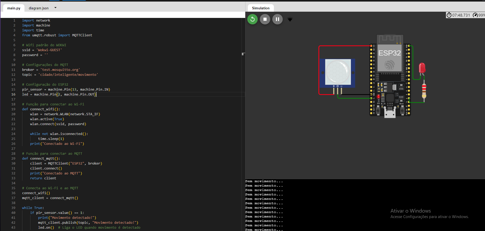
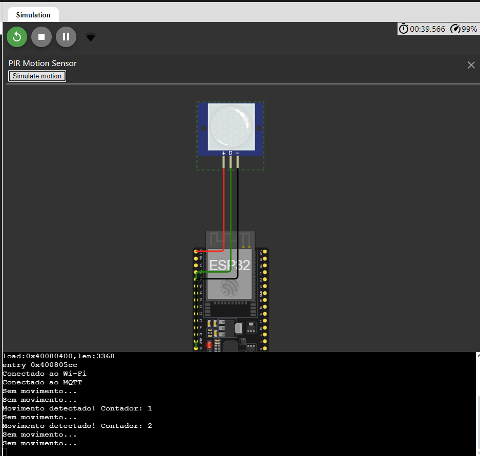
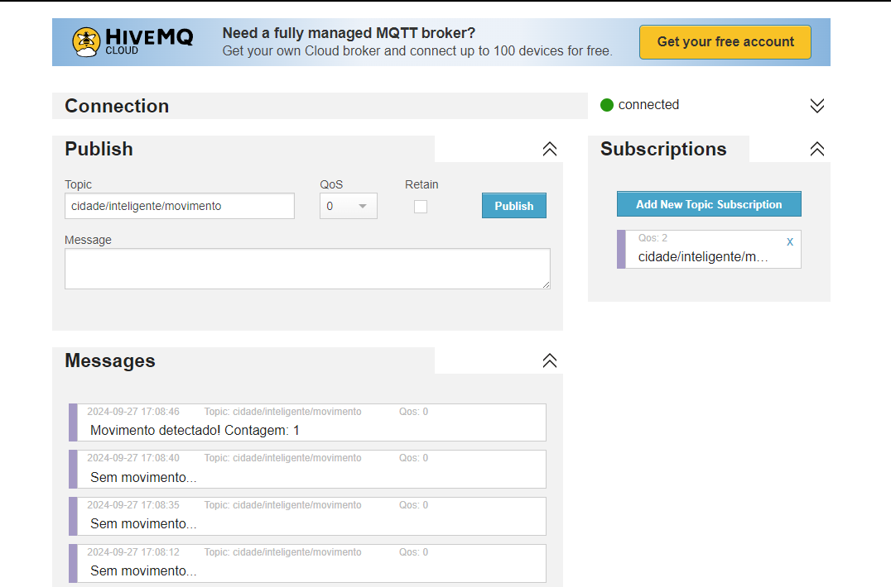

O objetivo do projeto é desenvolver um sistema de IoT usando um microcontrolador ESP32 programado em MicroPython para simular uma aplicação em smart city. O sistema inclui o uso de sensores , comunicação MQTT com o Mosquitto, e um painel de controle usando Node-RED.

## 1. Configuração do ESP32 no WokWi


```bash
Acesse o WokWi e escolha o ESP32 como microcontrolador.
Configure os sensores no ambiente de simulação:
Se você escolher um sensor de temperatura, adicione o sensor DHT22 ou DHT11.
No caso deste projeto será usado um PIR, Sensor de Movimento.
Configure o código em MicroPython para ler o Sensor que escolher E clique no Botão de PLAY/RUN.
Se estiver funcionando vai printar no terminal do Wokwi
```


## 2. Programação em MicroPython
```bash
import network
import machine
import time
from umqtt.robust import MQTTClient  

# Wifi padrão do WOKWI 
ssid = 'Wokwi-GUEST'
password = ''

# Configurações do MQTT
broker = 'test.mosquitto.org'
topic = 'cidade/inteligente/movimento'

# Configuração do ESP32
pir_sensor = machine.Pin(13, machine.Pin.IN)
led = machine.Pin(2, machine.Pin.OUT)

# Função para conectar ao Wi-Fi
def connect_wifi():
    wlan = network.WLAN(network.STA_IF)
    wlan.active(True)
    wlan.connect(ssid, password)

    while not wlan.isconnected():
        time.sleep(1)
    print("Conectado ao Wi-Fi")

# Função para conectar ao MQTT
def connect_mqtt():
    client = MQTTClient("ESP32", broker)
    client.connect()
    print("Conectado ao MQTT")
    return client

# Conecta ao Wi-Fi e ao MQTT
connect_wifi()
mqtt_client = connect_mqtt()

while True:
    if pir_sensor.value() == 1:
        print("Movimento detectado!")
        mqtt_client.publish(topic, "Movimento detectado!")
        led.on()  # Liga o LED quando movimento é detectado
    else:
        print("Sem movimento...")
        mqtt_client.publish(topic, "Sem movimento...")
        led.off()  # Desliga o LED quando não há movimento
    time.sleep(3)  # Intervalo de 3 segundos entre leituras


## 3. Integração dos Sensores
```bash
Sensores  Utilizados:
PIR: Sensor para Leitura do Movimento.
LED: Controle de iluminação inteligente ou sinalização.

Funções do Sensor no Contexto de Smart City:

Segurança: Monitoramento de áreas públicas ou privadas, como parques ou estacionamentos, para identificar presença de atividasdes suspeitas.
Iluminação : Controle de iluminação em locais públicos e privados, acendendo luzes quando há movimento e apagando quando não há, economizando energia.
Gestão de tráfego: Detectar a presença de pedestres em faixas de pedestres, otimizando semáforos e sistemas de tráfego.
```

## 4. Conectividade e Controle Remoto via Mosquitto ou HiveMQ


```bash
Acesse o Servidor de Teste do Mosquitto ou HiveMQ.
Conecte-se ao broker.
Assine os tópicos que você configurou no código do ESP32 para receber as leituras de movimento:
Topic to subscribe: cidade/inteligente/movimento
Para controlar o LED, publique no tópico de controle:
Topic to publish: cidade/inteligente/movimento
Message: O que preferir
```


## 5. Dashboard no Node-RED
```bash
Instale o Node-RED em sua máquina local ou use uma instância Cloud. (Será instalado na máquina local, caso queira instalar https://nodejs.org/pt)
Abra o editor do Node-RED e configure os nós MQTT para assinar os tópicos de temperatura, umidade e atuador.

Adicionar um nó de entrada MQTT:
```


