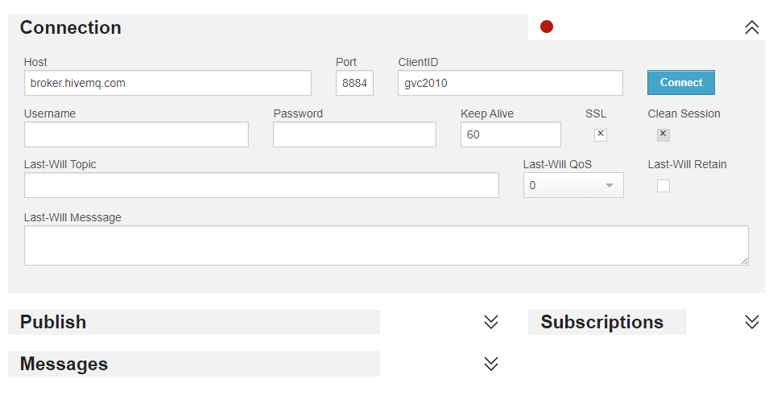

O objetivo do projeto é desenvolver um sistema de IoT usando um microcontrolador ESP32 programado em MicroPython para simular uma aplicação em smart city. O sistema inclui o uso de sensores ou atuadores, comunicação MQTT com o HiveMQ, e um painel de controle usando Node-RED.

## 1. Configuração do ESP32 no WokWi
```bash
Acesse o WokWi e escolha o ESP32 como microcontrolador.
Configure os sensores no ambiente de simulação:
Se você escolher um sensor de temperatura, adicione o sensor DHT22 ou DHT11.
No caso deste projeto será usado um PIR, Sensor de Movimento.
Configure o código em MicroPython para ler o Sensor que escolher
```

## 2. Programação em MicroPython
```bash
import network
import machine
import time
from umqtt.robust import MQTTClient  

# Wifi padrão do WOKWI 
ssid = 'Wokwi-GUEST'
password = ''

# Configurações do MQTT - Broker Gratuito
broker = 'broker.hivemq.com'
topic = 'cidade/inteligente/movimento'

# Configuração do ESP32
pir_sensor = machine.Pin(13, machine.Pin.IN)
led = machine.Pin(2, machine.Pin.OUT)
counter = 0

# Função para conectar ao Wi-Fi
def connect_wifi():
    wlan = network.WLAN(network.STA_IF)
    wlan.active(True)
    wlan.connect(ssid, password)

    while not wlan.isconnected():
        time.sleep(1)
    print("Conectado ao Wi-Fi")

# Função para conectar ao MQTT
def connect_mqtt():
    client = MQTTClient("ESP32", broker)
    client.connect()
    print("Conectado ao MQTT")
    return client

# Conecta ao Wi-Fi e ao MQTT
connect_wifi()
mqtt_client = connect_mqtt()

while True:
    if pir_sensor.value() == 1:
        counter += 1
        print(f"Movimento detectado! Contador: {counter}")
        mqtt_client.publish(topic, f"Movimento detectado! Contagem: {counter}")
        led.on()  # Liga o LED
    else:
        print("Sem movimento...")
        mqtt_client.publish(topic, "Sem movimento...")
        led.off()  # Desliga o LED
    time.sleep(5)  # Intervalo de 5 segundo
```

## 3. Integração dos Sensores
```bash
Sensores  Utilizados:
PIR: Sensor para Leitura do Movimento.
LED: Controle de iluminação inteligente ou sinalização.

Funções do Sensor no Contexto de Smart City:

Segurança: Monitoramento de áreas públicas ou privadas, como parques ou estacionamentos, para identificar presença de atividasdes suspeitas.
Iluminação : Controle de iluminação em locais públicos e privados, acendendo luzes quando há movimento e apagando quando não há, economizando energia.
Gestão de tráfego: Detectar a presença de pedestres em faixas de pedestres, otimizando semáforos e sistemas de tráfego.
```

## 4. Conectividade e Controle Remoto via MQTT



```bash
Acesse o HiveMQ WebSocket Client.
Conecte-se ao broker inserindo broker.hivemq.com no campo Host e clique em Connect.
Assine os tópicos que você configurou no código do ESP32 para receber as leituras de temperatura e umidade:
Topic to subscribe: cidade/inteligente/temperatura
Topic to subscribe: cidade/inteligente/umidade
Para controlar o LED, publique no tópico de controle:
Topic to publish: cidade/inteligente/atuador
Message: ligar_led ou desligar_led.
```

## 5. Dashboard no Node-RED
```bash
Instale o Node-RED em sua máquina local ou use uma instância hospedada.
Abra o editor do Node-RED e configure os nós MQTT para assinar os tópicos de temperatura, umidade e atuador.

Adicionar um nó de entrada MQTT:

Conecte-se ao broker broker.hivemq.com.
Assine o tópico cidade/inteligente/temperatura e cidade/inteligente/umidade para visualizar os dados.
Visualização no Dashboard:

Adicione gráficos para visualizar as leituras de temperatura e umidade em tempo real.
Para controle, adicione um botão para enviar comandos MQTT ao tópico cidade/inteligente/atuador para ligar ou desligar o LED.
Exemplo de Configuração no Node-RED:
Gráfico de Temperatura:
Usar o nó MQTT In para se inscrever no tópico cidade/inteligente/temperatura.
Conectar a um nó de gráfico para exibir as leituras de temperatura ao longo do tempo.
Botão de Controle de LED:
Usar o nó Button no dashboard, e quando clicado, ele deve publicar a mensagem ligar_led ou desligar_led no tópico cidade/inteligente/atuador.
```

